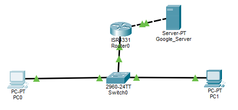

# Project 1: Branch Office Network Baseline & Gateway Architecture



## Executive Summary

This project establishes the foundational network infrastructure for a new 50-user branch office of Apex Medical Supplies. The primary objective was to deploy a reliable local area network (LAN) that facilitates high-speed internal communication while engineering an efficient "front door" (Default Gateway) to route data traffic to external public cloud resources.

By segregating local switching domains from edge routing functions, this design optimizes hardware expenditure, ensures predictable data pathways, and establishes a clean baseline for future security hardening.

## IP Addressing Plan

| Device | Interface | IP Address | Subnet Mask | Description |
|---|---|---|---|---|
| PC0 | FastEthernet0 | 192.168.1.1 | 255.255.255.0 (/24) | Management Workstation |
| PC1 | FastEthernet0 | 192.168.1.2 | 255.255.255.0 (/24) | Standard Employee Workstation |
| Switch0 | VLAN 1 | 192.168.1.5 | 255.255.255.0 (/24) | Switch Virtual Interface (SVI) |
| Router0 | Gig0/0/0 | 192.168.1.254 | 255.255.255.0 (/24) | Inside Gateway (LAN) |
| Router0 | Gig0/0/1 | 8.8.8.2 | 255.255.255.252 (/30) | Outside Gateway (WAN Link) |
| Google_Server | FastEthernet0 | 8.8.8.1 | 255.255.255.252 (/30) | Simulated Cloud Destination |

> **Note:** 8.8.8.1 is utilized here strictly within a simulated environment to replicate connectivity to public internet cloud resources.

## Problem, Constraints, & Engineering Decisions

### 1. The Business Problem

The branch office required rapid deployment of desktop workstations needing access to local resources (file sharing, internal printers) as well as continuous access to public internet applications. The infrastructure had to be built using bare-metal Cisco operating system commands rather than automated wizards to ensure exact management of device privileges.

### 2. Design Constraints

- **Budgetary Limits:** Capital allocation restricted the use of high-density routers. Routing hardware processing must be strictly reserved for traffic entering and leaving the building, not local data.
- **WAN Efficiency:** The connection between the edge router and the external public server is a point-to-point link. The subnetting scheme must be highly efficient to prevent wasting usable public IP space.

### 3. Engineering Decisions & Architectural Rationales

- **Layer 2 vs. Layer 3 Segmentation:** I deployed a dedicated access-layer switch (2960-24TT) to manage all local traffic via hardware MAC-address forwarding. This keeps internal office traffic fast and cost-free, ensuring we only saturate the router's CPU when data explicitly leaves the local network.
- **Point-to-Point WAN Subnetting:** I configured the WAN interface (Gig0/0/1) and the external server with a /30 subnet mask (255.255.255.252). This strictly limits the network segment to 2 usable host IP addresses, preventing address waste on the external boundary.

## Device Configuration Blueprint

### Access-Layer Switch (Switch0) — Remote Management Baseline

```
enable
configure terminal

! Allocate virtual interface for remote management identity
interface vlan 1
 ip address 192.168.1.5 255.255.255.0
 no shutdown
exit

! Harden communication lines for authenticated remote access
line vty 0 4
 password cisco
 login
exit
enable password cisco
```

### Edge Router (Router0) — Dual-Home Gateway Extraction

```
enable
configure terminal

! Configure Inside Interface (The Branch Office Door)
interface GigabitEthernet 0/0/0
 ip address 192.168.1.254 255.255.255.0
 no shutdown
exit

! Configure Outside Interface (Point-to-Point WAN Link)
interface GigabitEthernet 0/0/1
 ip address 8.8.8.2 255.255.255.252
 no shutdown
```

## Real-World Troubleshooting & Engineering Lessons

### Incident 1: Restricted Privilege Execution Error

- **Symptom:** The terminal rejected configuration commands with a `% Invalid input detected at '^' marker.` error.
- **Root Cause Analysis:** Commands were executed while the prompt displayed `Router>`. This indicates the terminal was sitting in restricted User Exec Mode, which lacks the administrative privileges required to alter the hardware's running configuration.
- **Resolution:** Executed the `enable` command to escalate the security context to Privileged Exec Mode (`Router#`), unlocking the global configuration path.

### Incident 2: Initial Connection Latency & Line Hangups

- **Symptom:** Upon initializing the remote management tunnel from PC0, the session froze on `Trying 192.168.1.5 ...` while the switch link lights remained solid amber.
- **Root Cause Analysis:** This delay was caused by the automatic initialization of Spanning Tree Protocol (STP). To protect the network from catastrophic data loops, the switch blocks traffic on a newly awakened port for 30 seconds while cycling through Listening and Learning phases.
- **Resolution:** Allowed the default convergence timer to safely expire. Once the link state entered the Forwarding state (turning green), the connection initialized.

> **Note:** Transitioning these end-user ports to a PortFast architecture is scheduled for Phase 2 to safely eliminate this delay for end-users.

### Incident 3: Subnet Boundary Mismatch (Invalid IP Error)

- **Symptom:** When attempting to apply the optimized /30 subnet mask (255.255.255.252) to the external server, the user interface rejected the configuration with an `Invalid IP for this subnet mask entered` error.
- **Root Cause Analysis:** The network domain was originally built using an oversized, flat /8 address scheme (8.8.8.8 host and 8.8.8.254 gateway). A /30 subnet mask restricts a network segment to a tiny, 4-address binary block. For the 8.8.8.0 subnet, the boundaries are strictly defined as:
  - `8.8.8.0` — Network ID
  - `8.8.8.1` & `8.8.8.2` — The only two usable host IPs
  - `8.8.8.3` — Broadcast ID

  Because 8.8.8.8 and 8.8.8.254 mathematically fall completely outside of that 4-address range, the operating system correctly flagged the configuration as a boundary violation.
- **Resolution:** Re-engineered the point-to-point allocation by shifting the IP addresses down into the valid host range. Assigned 8.8.8.1 to the server and 8.8.8.2 to the router's WAN interface.

### Incident 4: Initial ICMP Packet Loss (The 25% Drop)

- **Symptom:** The very first execution of `ping 8.8.8.1` resulted in a single `Request timed out` drop before succeeding, as documented below:

```
C:\>ping 8.8.8.1
Pinging 8.8.8.1 with 32 bytes of data:

Request timed out.
Reply from 8.8.8.1: bytes=32 time<1ms TTL=127
Reply from 8.8.8.1: bytes=32 time<1ms TTL=127
Reply from 8.8.8.1: bytes=32 time=1ms TTL=127

Ping statistics for 8.8.8.1:
    Packets: Sent = 4, Received = 3, Lost = 1 (25% loss),
```

- **Root Cause Analysis:** This is expected network behavior. The edge router understood the logical IP pathing, but its Layer 2 ARP (Address Resolution Protocol) table was empty for that new WAN segment. The router had to pause the first ICMP packet to broadcast an ARP request across the wire to discover the server's physical MAC address. The time spent waiting for this hardware handshake caused the first ping packet's timer to expire.
- **Resolution:** No corrective action required. A second ping immediately followed to confirm that once the MAC address was successfully cached in the hardware table, traffic flowed with 0% loss.

## Verification & Traffic Validation

To verify final end-to-end routing stability after ARP table resolution, a second ICMP diagnostic echo was executed from PC0 to 8.8.8.1. This confirms full, line-rate communication across the gateway boundary.

```
C:\>ping 8.8.8.1
Pinging 8.8.8.1 with 32 bytes of data:

Reply from 8.8.8.1: bytes=32 time<1ms TTL=127
Reply from 8.8.8.1: bytes=32 time<1ms TTL=127
Reply from 8.8.8.1: bytes=32 time<1ms TTL=127
Reply from 8.8.8.1: bytes=32 time<1ms TTL=127

Ping statistics for 8.8.8.1:
    Packets: Sent = 4, Received = 4, Lost = 0 (0% loss),
Approximate round trip times in milli-seconds:
    Minimum = 0ms, Maximum = 0ms, Average = 0ms
```

### Technical Verification Note (The TTL Proof)

The successful replies returned a `TTL=127` value. Because a Windows host initializes ICMP packets with a default TTL of 128, the decrement to 127 mathematically proves that the packet successfully traversed exactly one Layer 3 routing boundary to reach the external network segment.
