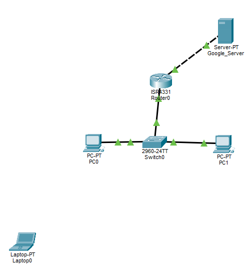
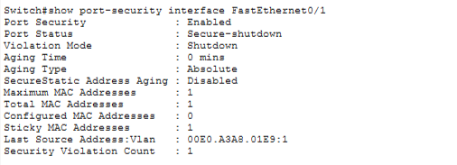
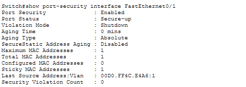

# Project 2: Access-Layer Security Hardening



## Executive Summary

This project hardens the access-layer switch ports of the Apex Medical Supplies branch office against unauthorized device connections. Building on the Project 1 baseline (PC0, PC1, and a Layer 3 gateway/WAN link), this phase addresses a security audit finding: open wall-jacks in shared spaces (lobbies, conference rooms) allow any visitor or employee to plug in an unauthorized device and gain access to the internal LAN.

The objective was to lock each access port to a single authorized device, eliminate the default connectivity delay for legitimate users, and ensure that any unauthorized device is automatically and immediately isolated — without requiring on-site IT staff to intervene.

## Problem, Constraints, & Engineering Decisions

### 1. The Business Problem

The branch office has end-user wall-jacks in areas accessible to visitors and non-IT staff. If an unauthorized laptop, rogue switch, or hub is plugged into one of these ports, it could gain direct access to the internal 192.168.1.0/24 network, bypassing any perimeter protections. Additionally, an accidental loop (e.g., a patch cable plugged into two wall-jacks) could trigger a broadcast storm and take down the switch.

### 2. Design Constraints

- **Zero software budget**: No Network Access Control (NAC) platform (e.g., Cisco ISE) is available. The solution must use features native to the existing Cisco 2960 switch.
- **No on-site IT staff**: Any security violation must be contained automatically, without requiring a technician to manually intervene at the time of the incident.
- **User experience**: Legitimate employees moving between desks must get network access immediately — they cannot tolerate the default ~30-second Spanning Tree Protocol (STP) delay every time they plug in.

### 3. Engineering Decisions & Architectural Rationales

**Port Security with Sticky MAC Learning and Shutdown Violation Mode**: Each access port (Fa0/1, Fa0/2) was configured to allow a maximum of one MAC address, dynamically learned and permanently recorded ("sticky") the first time the legitimate device communicates. If any other MAC address is detected on that port, the switch immediately disables it (`err-disabled` / `Secure-shutdown`). This converts a manual physical-security audit into an automatic, zero-cost enforcement mechanism.

**PortFast**: By default, an access port spends ~30 seconds cycling through STP's Listening and Learning states before forwarding traffic — a delay designed to prevent network loops, but one that produces a poor experience for end users on ports where only a single device will ever be connected. PortFast was enabled on Fa0/1 and Fa0/2 to bypass this delay entirely.

**BPDU Guard**: Enabling PortFast on a port disables its normal loop-detection behavior, creating risk if someone plugs in a switch or hub (intentionally or accidentally) and creates a loop. BPDU Guard was enabled alongside PortFast to act as a bodyguard: if the port receives a Bridge Protocol Data Unit (BPDU) — a signal that another switch is on the other end — the port is immediately disabled. This gives end users instant connectivity while still fully protecting against loops.

## Device Configuration Blueprint

### Access-Layer Switch (Switch0) — Port Hardening on Fa0/1 and Fa0/2

```
enable
configure terminal
interface range FastEthernet 0/1 - 2
switchport mode access
switchport port-security
switchport port-security maximum 1
switchport port-security mac-address sticky
switchport port-security violation shutdown
spanning-tree portfast
spanning-tree bpduguard enable
end
```

**Note on FastEthernet0/3**: This port connects to Router0 (the gateway uplink) and was intentionally excluded from this configuration. Port security, PortFast, and BPDU Guard are designed for single-end-device access ports — applying them to an inter-device uplink would be a misconfiguration and could disable the entire branch's WAN connectivity.

## Verification: Baseline MAC Address Learning

After applying the configuration, each port shows zero learned MAC addresses until the connected device sends traffic. A simple ping from each PC to the gateway (`192.168.1.254`) triggers the switch to learn and permanently record that device's MAC address.

**Fa0/1 (PC0) after baseline traffic:**
```
Port Security              : Enabled
Port Status                : Secure-up
Violation Mode             : Shutdown
Maximum MAC Addresses      : 1
Total MAC Addresses        : 1
Sticky MAC Addresses       : 1
Last Source Address:Vlan   : 00D0.FF4C.E4A6:1
Security Violation Count   : 0
```

**Fa0/2 (PC1) after baseline traffic:**
```
Total MAC Addresses        : 1
Sticky MAC Addresses       : 1
Last Source Address:Vlan   : 0090.0C00.A09C:1
```

Both ports are now bound to their respective authorized devices.

## Outcome: Simulated Security Breach

To validate the configuration under real conditions, an unauthorized device (Laptop0, MAC `00E0.A3A8.01E9`) was connected to Fa0/1 in place of PC0 — simulating a scenario where someone unplugs an authorized workstation in a lobby or conference room and plugs in their own device.

**Result — immediate automatic lockdown, before any traffic was even sent by the operator:**



```
Port Security              : Enabled
Port Status                : Secure-shutdown
Violation Mode             : Shutdown
Maximum MAC Addresses      : 1
Total MAC Addresses        : 1
Sticky MAC Addresses       : 1
Last Source Address:Vlan   : 00E0.A3A8.01E9:1
Security Violation Count   : 1
```

The switch detected that the MAC address presented on Fa0/1 (`00E0.A3A8.01E9`) did not match the address bound to that port (`00D0.FF4C.E4A6`), and immediately moved the interface into `err-disabled` / `Secure-shutdown` state. The unauthorized device received zero network access. No administrator action was required to contain the threat — it was contained at the moment of connection.

## Recovery: Rollback Procedure

Cisco IOS does not automatically recover a port from `err-disabled` state — this is by design, ensuring an administrator is aware a violation occurred. The recovery procedure is a simple, low-risk interface reset:

```
configure terminal
interface FastEthernet0/1
shutdown
no shutdown
exit
end
```

**Why this is safe as a rollback**: `shutdown` administratively disables the interface, and `no shutdown` re-enables it. This forced toggle clears the `err-disabled` flag and lets the port re-initialize. It does not erase the sticky MAC address binding or any other port-security configuration — the original authorized device (PC0) reconnects normally with no reconfiguration needed.

**Post-recovery verification:**


```
Port Security              : Enabled
Port Status                : Secure-up
Violation Mode             : Shutdown
Total MAC Addresses        : 1
Sticky MAC Addresses       : 1
Last Source Address:Vlan   : 00D0.FF4C.E4A6:1
Security Violation Count   : 0
```

The port returned to a healthy `Secure-up` state with PC0's original MAC address still bound, and the violation count reset to zero.

## Real-World Troubleshooting & Engineering Lessons

### Incident 1: Command Syntax Typos

**Symptom**: Two commands were rejected with `% Invalid input detected at '^' marker.` — `switchort port-security` and `spanning-treebpduguard enable`.

**Root Cause Analysis**: The first error was a missing letter (`switchort` instead of `switchport`). The second was a missing space, causing `spanning-tree` and `bpduguard` to be read as a single unrecognized command. Cisco IOS performs no fuzzy matching — a single character error is rejected outright.

**Resolution**: Both commands were retyped correctly on the next line and applied successfully. The `--More--` pagination and warning messages following `spanning-tree portfast` (cautioning that PortFast should only be used on single-host ports) are expected, informational output — not errors.

### Incident 2: Configuration Verification — "Missing" Settings in show running-config

**Symptom**: After configuration, `show running-config` did not display `switchport port-security violation shutdown` or `switchport port-security maximum 1` under either interface, despite both commands being entered successfully.

**Root Cause Analysis**: Cisco IOS omits configuration lines from `show running-config` when they match the system default. `shutdown` is the default violation mode, and `1` is the default maximum MAC address count — so both settings are active but not displayed. This was confirmed via `show port-security interface`, which explicitly reports the active (not just configured) values.

**Resolution**: No corrective action needed. This is a documentation/verification lesson: `show running-config` shows *configured deviations from default*, while `show port-security interface` shows *actual operational state* — the latter is the authoritative source for verifying security posture.

### Incident 3: Identifying err-disabled vs. a Simple Down Link

**Symptom**: After connecting the rogue laptop to Fa0/1, the link indicator showed red/down on the topology diagram — before any ping was sent from the laptop.

**Root Cause Analysis**: A red link in Packet Tracer can indicate either a genuinely down/unconfigured interface or a security-triggered `err-disabled` state — visually, these can look identical. `show ip interface brief` confirmed Fa0/1 was `down/down` while Fa0/3 (the router uplink) remained `up/up`, ruling out a broader outage. `show interfaces FastEthernet0/1 status` then confirmed the specific cause: `err-disabled`. The security check triggered on link-up itself (when the laptop's NIC began sending its MAC address), without requiring an explicit ping.

**Resolution**: No corrective action needed for the breach itself — this was the intended behavior. This incident highlights the importance of using multiple verification commands (`show ip interface brief`, `show interfaces ... status`, and `show port-security interface`) to distinguish between a passive link failure and an active security response, since the visual indicators alone are ambiguous.

## Business Impact

This configuration converts the security posture of every access port from "trust by default" to "deny by default, with automatic enforcement." Any unauthorized device connected to a hardened port — whether a visitor's laptop in a conference room or a rogue access point plugged in by an unaware employee — is contained within milliseconds, with zero IT staff response time required. At the same time, legitimate employees experience instant connectivity via PortFast, with BPDU Guard ensuring that this speed does not come at the cost of loop protection. The rollback procedure is a two-command interface reset, meaning a remote technician can restore a falsely-triggered port in under a minute without needing to alter the underlying security policy.
