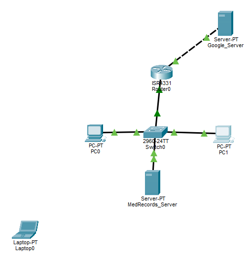

# Project 3: VLAN Segmentation & Incident Containment



## Executive Summary

This project segments the flat 192.168.1.0/24 network from Projects 1–2 into four logical zones (Corporate, Guest Wi-Fi, Server, and Quarantine) using VLANs, 802.1Q trunking, and router subinterfaces ("router-on-a-stick"). The business driver is twofold: HIPAA-relevant traffic (medical records) was previously sharing a broadcast domain with general corporate and future guest traffic, and a simulated phishing incident on a Corporate workstation (PC1) demonstrated the need to isolate a compromised host quickly.

The project builds and verifies the segmented topology end-to-end, then runs a simulated incident response: PC1 is treated as "compromised" and moved into a Quarantine VLAN. The before/after comparison shows what containment VLANs alone actually deliver, and where the remaining gap is, which Project 5 (ACLs) is scoped to close.

## IP Addressing Plan

| VLAN | Name | Subnet | Usable Range | Gateway (Router Subinterface) |
|---|---|---|---|---|
| 10 | Corporate | 192.168.1.0/26 | .1 – .62 | 192.168.1.1 (Gi0/0/0.10) |
| 20 | Guest Wi-Fi | 192.168.1.64/26 | .65 – .126 | 192.168.1.65 (Gi0/0/0.20) |
| 30 | Server | 192.168.1.128/26 | .129 – .190 | 192.168.1.129 (Gi0/0/0.30) |
| 99 | Quarantine | 192.168.1.192/27 | .193 – .222 | 192.168.1.193 (Gi0/0/0.99) |

| Device | Interface | Switch Port | IP Address | Subnet Mask | VLAN |
|---|---|---|---|---|---|
| PC0 | FastEthernet0 | Fa0/1 | 192.168.1.2 | 255.255.255.192 (/26) | 10 (Corporate) |
| PC1 | FastEthernet0 | Fa0/2 | 192.168.1.3 → 192.168.1.194 (post-incident) | /26 → /27 | 10 → 99 |
| MedRecords_Server | FastEthernet0 | Fa0/4 | 192.168.1.130 | 255.255.255.192 (/26) | 30 (Server) |
| Router0 | Gi0/0/0 (trunk) | connects to switch Fa0/3 | N/A (subinterfaces only) | N/A | 10,20,30,99 |
| Router0 | Gi0/0/1 (WAN, untouched) | N/A | 8.8.8.2 | 255.255.255.252 (/30) | N/A |
| Google_Server | FastEthernet0 | N/A | 8.8.8.1 | 255.255.255.252 (/30) | N/A |

> **Note**: 192.168.1.0/24 was re-subnetted from Project 1's single flat /24 into per-VLAN /26s (and a /27 for Quarantine). A 50-user office split across zones doesn't need 254 addresses per zone. Right-sizing to /26 leaves room to grow without wasting address space.

## Problem, Constraints, & Engineering Decisions

### 1. The Business Problem

Apex Medical Supplies' flat network architecture meant HIPAA-relevant traffic (medical records) shared the same broadcast domain as general corporate traffic and future guest Wi-Fi. Separately, an employee clicked a phishing link, infecting their workstation (PC1). The business needed a demonstration of how network segmentation limits how far that infection, or any unauthorized access, could spread to other zones or critical systems.

### 2. Design Constraints

- **Single physical switch and router**: No budget for additional hardware. Segmentation had to be achieved logically (VLANs + trunking + subinterfaces) on the existing 2960-24TT and ISR4331.
- **Must build on Projects 1–2 without breaking them**: Port security, PortFast, and BPDU Guard configured in Project 2 had to remain intact and compatible with new VLAN assignments. The router uplink (Fa0/3), already excluded from port security in Project 2, became the 802.1Q trunk.
- **Phased rollout**: ACL-based access enforcement is explicitly out of scope for this phase (deferred to Project 5), so the "before/after" comparison must be evaluated honestly against what VLANs alone provide.

### 3. Engineering Decisions & Architectural Rationales

- **VLANs 10/20/30/99 with 802.1Q trunking**: Four VLANs were created (Corporate, Guest, Server, and Quarantine), with the router uplink (Fa0/3) converted to an 802.1Q trunk carrying all four. This allows a single physical link to carry traffic for multiple logical networks, tagging each frame with its VLAN ID.
- **Router-on-a-stick (subinterfaces)**: Rather than adding a router-per-VLAN (cost-prohibitive) or a Layer 3 switch (not in budget), Router0's single Gi0/0/0 interface was split into four subinterfaces (.10, .20, .30, .99), each acting as the default gateway for its respective VLAN. This is the standard small-business approach to inter-VLAN routing with a single router.
- **Per-VLAN /26 (and /27) subnetting**: The original /24 was broken into right-sized subnets per zone, demonstrating deliberate address planning rather than reusing an oversized flat range per VLAN.
- **VLAN 20 (Guest) provisioned but unpopulated**: The Guest VLAN and its gateway subinterface were created as part of the addressing plan but intentionally have no devices assigned yet. This project's scope is the Corporate/Server/Quarantine interaction; Guest Wi-Fi devices are a future addition.

### Decision: Extending Port Hardening to Fa0/4 (MedRecords_Server)

Project 2 hardened Fa0/1 and Fa0/2 (PC0 and PC1) with port security (sticky MAC, max 1, violation shutdown), PortFast, and BPDU Guard, explicitly excluding only Fa0/3 (the router uplink, a multi-device trunk). Project 3 introduces a new access port, Fa0/4, connecting MedRecords_Server.

Left undocumented, this would be a silent gap in the Problem → Constraint → Decision → Outcome chain: every new single-device access port should either receive the same hardening as Fa0/1/Fa0/2, or have a stated reason why not. Given that MedRecords_Server is arguably the most sensitive device on the network (it holds HIPAA-relevant data), deferring its hardening would be the weaker decision. Fa0/4 was therefore brought into the same port-security/PortFast/BPDU Guard pattern as Fa0/1 and Fa0/2, configured and verified as part of this project (see Device Configuration Blueprint below).

### Decision: Migrating the Management SVI from VLAN 1 to VLAN 10

Project 1 configured Switch0's management interface (`interface vlan 1`, the Switch Virtual Interface) at `192.168.1.5/24` for remote Telnet/SSH access. Project 3's re-subnetting moved every access port (Fa0/1, Fa0/2, Fa0/4) off VLAN 1 and onto VLANs 10, 30, and 99, with VLAN 1 retaining no member ports and no router subinterface.

Left as-is, VLAN 1's SVI would become an orphaned management interface: still configured with an IP, but with no Layer 2 ports carrying VLAN 1 traffic to it and no Layer 3 path (no `Gi0/0/0.1` subinterface) routing to its `/24`. The switch's management IP would likely become unreachable from other VLANs after this project's changes.

**Decision**: Rather than document this as a deferred gap, `interface vlan 1` was administratively shut down, and the SVI was re-created on `interface vlan 10` (Corporate) at `192.168.1.5/26`, which fits cleanly within VLAN 10's `.1–.62` range. This keeps the switch's management address on a populated, routed VLAN consistent with the new addressing plan, and avoids carrying forward an orphaned management interface into Project 4 (Change Management).

## Device Configuration Blueprint

### Access-Layer Switch (Switch0): VLAN Creation & Port Assignment

```
enable
configure terminal

! Create VLANs
vlan 10
 name Corporate
exit
vlan 20
 name Guest
exit
vlan 30
 name Server
exit
vlan 99
 name Quarantine
exit

! Assign access ports
interface FastEthernet0/1
 switchport mode access
 switchport access vlan 10
exit
interface FastEthernet0/2
 switchport mode access
 switchport access vlan 10
exit
interface FastEthernet0/4
 switchport mode access
 switchport access vlan 30
 switchport port-security
 switchport port-security maximum 1
 switchport port-security mac-address sticky
 switchport port-security violation shutdown
 spanning-tree portfast
 spanning-tree bpduguard enable
exit

! Configure trunk to Router0
interface FastEthernet0/3
 switchport mode trunk
 switchport trunk allowed vlan 10,20,30,99
exit
end
```

> **Note**: Port security, PortFast, and BPDU Guard from Project 2 (applied to Fa0/1 and Fa0/2) remain in effect and are compatible with the VLAN access-port assignments above. These features operate independently of VLAN membership. Fa0/4 (MedRecords_Server) was brought into this same hardening pattern as part of Project 3 — see "Decision: Extending Port Hardening to Fa0/4" below.

### Edge Router (Router0): Subinterfaces for Inter-VLAN Routing

```
enable
configure terminal

interface GigabitEthernet0/0/0
 no shutdown
exit

interface GigabitEthernet0/0/0.10
 encapsulation dot1Q 10
 ip address 192.168.1.1 255.255.255.192
exit

interface GigabitEthernet0/0/0.20
 encapsulation dot1Q 20
 ip address 192.168.1.65 255.255.255.192
exit

interface GigabitEthernet0/0/0.30
 encapsulation dot1Q 30
 ip address 192.168.1.129 255.255.255.192
exit

interface GigabitEthernet0/0/0.99
 encapsulation dot1Q 99
 ip address 192.168.1.193 255.255.255.224
exit
end
```

> **Note**: The physical Gi0/0/0 interface itself carries no IP address; only its subinterfaces do. Gi0/0/1 (WAN link to Google_Server, 8.8.8.2/30) was left untouched from Project 1.

### Access-Layer Switch (Switch0): Management SVI Migration

```
enable
configure terminal

interface vlan 1
 no ip address
 shutdown
exit

interface vlan 10
 ip address 192.168.1.5 255.255.255.192
 no shutdown
exit
end
```

Verified via `show running-config`: `interface Vlan1` now shows no IP address and `shutdown`, and `interface Vlan10` shows `192.168.1.5 255.255.255.192` with no shutdown. The switch's management address moved cleanly from the old flat `/24` on an unused VLAN to a right-sized `/26` on the active Corporate VLAN, with no duplicate IP configuration left behind.

## Real-World Troubleshooting & Engineering Lessons

### Incident 1: Stale ARP Entry for Decommissioned Gateway

- **Symptom**: A ping from PC0 to `192.168.1.254`, the old Project 1 gateway address which no longer exists on Router0, succeeded with `TTL=255`.
- **Root Cause Analysis**: `show ip interface brief` on Router0 confirmed `.254` is not configured on any interface. The successful reply was a stale ARP cache entry left over from Project 1, where PC0 had previously resolved `.254` to Router0's MAC address. Since the same physical interface (now Gi0/0/0) is still up, the cached Layer 2 mapping allowed an ARP-level reply even though the IP is no longer routable.
- **Resolution**: No corrective action required. This is a leftover artifact of the address change, not a misconfiguration. It will age out of PC0's ARP cache naturally and does not affect actual traffic, since nothing in the current design routes to or through `.254`.

### Incident 2: Rejected Command During SVI Migration

- **Symptom**: While entering `interface vlan 10` during the management SVI migration, the switch returned `% Invalid input detected at '^' marker.`
- **Root Cause Analysis**: This was a single-attempt typo/paste error on the first entry of the command; the corrected line `interface vlan 10` was accepted immediately on the next attempt, producing `Switch(config-if)#` followed by `%LINK-5-CHANGED: Interface Vlan10, changed state to up`.
- **Resolution**: No corrective action required beyond retyping the command correctly. Cisco IOS performs no fuzzy matching, so even a minor typo is rejected outright (consistent with Project 2, Incident 1).

## Verification & Traffic Validation: Incident/Quarantine Simulation

### Before: PC1 in VLAN 10 (Corporate)

With PC1 at `192.168.1.3/26`, gateway `192.168.1.1`, double-pings to all relevant destinations succeeded:

```
PC1 → 192.168.1.1   (Corporate gateway):  4/4, TTL=255
PC1 → 192.168.1.2   (PC0, same VLAN):     4/4, TTL=128
PC1 → 192.168.1.130 (MedRecords, Server VLAN): 4/4, TTL=127
PC1 → 8.8.8.1       (WAN/Google_Server):  4/4, TTL=127
```

All targets reachable, consistent with a fully flat-routed network where Corporate, Server, and WAN traffic all pass freely.

### The Containment Action

On Switch0:

```
enable
configure terminal
interface FastEthernet0/2
 switchport access vlan 99
exit
end
show vlan brief
```

`show vlan brief` confirmed Fa0/2 moved from VLAN 10 to VLAN 99.

PC1 was then re-addressed for the Quarantine subnet (192.168.1.192/27):

- IP Address: `192.168.1.194`
- Subnet Mask: `255.255.255.224`
- Default Gateway: `192.168.1.193`

### After: PC1 in VLAN 99 (Quarantine)

```
PC1 → 192.168.1.193 (Quarantine gateway): 4/4, TTL=255
PC1 → 192.168.1.1   (Corporate gateway):  4/4, TTL=255
PC1 → 192.168.1.130 (MedRecords, Server VLAN): 4/4, TTL=127
PC1 → 8.8.8.1       (WAN/Google_Server):  4/4, TTL=127
```

### Before/After Comparison & Honest Findings

| Destination | Before (VLAN 10) | After (VLAN 99) |
|---|---|---|
| Own gateway | ✅ 4/4 | ✅ 4/4 (new gateway, .193) |
| Corporate gateway (192.168.1.1) | ✅ 4/4 | ✅ 4/4 |
| Server VLAN (MedRecords, 192.168.1.130) | ✅ 4/4 | ✅ 4/4 |
| WAN (8.8.8.1) | ✅ 4/4 | ✅ 4/4 |

**What changed:**
- PC1 was removed from the VLAN 10 broadcast domain and reassigned to VLAN 99, confirmed via `show vlan brief`.
- PC1 received a new IP in an isolated subnet (192.168.1.192/27) distinct from the Corporate range (192.168.1.0/26).
- Any Layer 2 attack vector dependent on shared broadcast domain membership (ARP-based attacks, L2 network discovery/scanning) is now cut off. PC1 can no longer see or be seen by VLAN 10 broadcast/ARP traffic.

**What did not change:**
- All Layer 3 (routed IP) reachability remained identical before and after. Router0 routes freely between all configured subinterfaces (.10, .20, .30, .99) by default, with no access restrictions in place.
- A compromised host using IP-based lateral movement (e.g., reaching the medical records server) or exfiltration (e.g., reaching the WAN) would be **unaffected** by this VLAN move alone.

**Conclusion**: VLAN segmentation, on its own, limits the **Layer 2 attack surface** (broadcast-based and same-subnet discovery/attack methods) but does **not** restrict **Layer 3 routed traffic** between zones. For a HIPAA-relevant scenario where the primary risk is a compromised host reaching the medical records server or exfiltrating data over the WAN, VLANs alone are **necessary but not sufficient**. This gap, enforcing that Quarantine (and eventually Guest) traffic cannot reach Server or other restricted zones at the IP layer, is the explicit driver for **Project 5 (Access Control Lists)**.

## Topology Notes

The topology screenshot includes `Laptop0` (bottom-left), the unauthorized device used in Project 2's port-security breach simulation. It remains on the canvas for continuity across projects but is **not used** in Project 3. VLAN 20 (Guest) is provisioned with a gateway subinterface but has no devices assigned in this phase.
